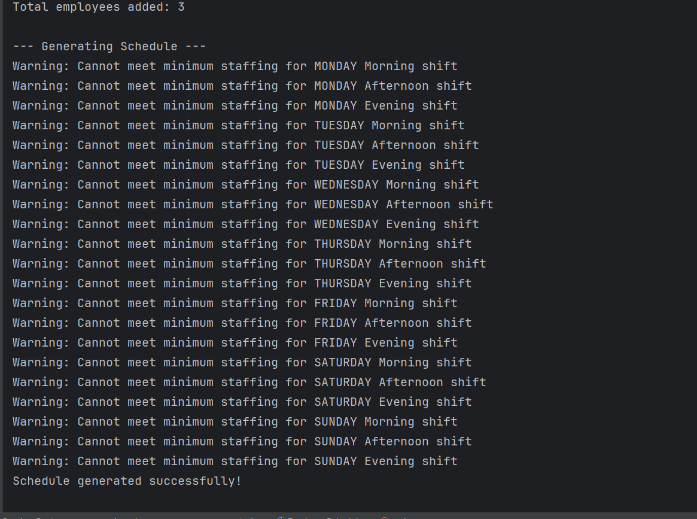

# Employee Scheduler Application - Multi-Language Implementation

A comprehensive employee scheduling system implemented in both **Ruby** and **Java**, demonstrating advanced control structures and object-oriented programming principles across different programming paradigms.

## 📋 Overview

This project showcases two distinct implementations of an employee scheduling system:
- **Ruby Implementation**: Feature-rich with priority-based scheduling and real-time conflict resolution
- **Java Implementation**: Object-oriented design with enum-based shift management and comprehensive error handling

Both implementations manage employee schedules across a 7-day week with three daily shifts (Morning, Afternoon, Evening) while ensuring fair distribution of work hours and meeting business requirements.

## 🎯 Core Features (Both Implementations)

### Scheduling Rules
- ✅ **No Double Shifts**: Employees cannot work more than one shift per day
- ✅ **Work-Life Balance**: Maximum 5 working days per employee per week
- ✅ **Minimum Staffing**: Each shift requires at least 2 employees
- ✅ **Fair Distribution**: Balanced assignment algorithms
- ✅ **Conflict Resolution**: Smart handling of scheduling conflicts

### Advanced Features
- 📊 **Comprehensive Reporting**: Detailed schedule output with statistics
- 🔄 **Multi-Phase Scheduling**: Optimized assignment algorithms
- ⚠️ **Error Handling**: Robust validation and user guidance
- 📈 **Performance Tracking**: Employee work summaries and utilization reports

## 💎 Ruby Implementation (`EmployeeScheduler.rb`)

### Ruby-Specific Features
- **Priority-Based Scheduling**: Employees can set shift priorities (1=High, 2=Medium, 3=Low)
- **Real-Time Availability**: Live capacity checking during registration
- **Interactive Interface**: User-friendly prompts with visual feedback
- **Capacity Control**: Maximum 3 employees per shift during booking phase


```
Enter employee information. Type 'done' as employee name to finish early.
Enter name for employee 1: Alice
Enter shift preferences for Alice.
Valid shifts: MORNING, AFTERNOON, EVENING. Enter 'skip' to skip a day, or 'cancel' to skip this employee.

Preference for Monday:
Enter shift (MORNING, AFTERNOON, EVENING), 'skip', or 'cancel': morning
```

## ☕ Java Implementation (`EmployeeScheduler.rb`)

### Java-Inspired Features (Converted to Ruby)
- **Enum-like Classes**: Type-safe shift and day management
- **Static Methods**: Class-level utility functions
- **Object-Oriented Design**: Clear separation of concerns with nested classes
- **Exception Management**: Comprehensive error handling with try-catch patterns

### Java-Style Control Structures (in Ruby)


| Feature | Ruby Implementation | Java-Style Implementation |
|---------|-------------------|---------------------------|
| **Data Types** | Dynamic typing with symbols | Static-like typing with constants |
| **Error Handling** | `begin/rescue/end` | `begin/rescue` (try-catch style) |
| **Collections** | Native Hash/Array | Hash/Array with Java-like methods |
| **Method Naming** | `snake_case` | `snake_case` (converted from camelCase) |
| **Class Structure** | Ruby classes with modules | Nested classes (Java-style) |
| **Iterators** | Ruby blocks (`each`, `map`) | Enhanced for-loop equivalents |

## 📊 Sample Output (Both Versions)

```
================================================================================
                    WEEKLY EMPLOYEE SCHEDULE
================================================================================
Day         Morning                  Afternoon                Evening         
--------------------------------------------------------------------------------
Monday      Alice, Bob               Charlie, Diana           Eve, Frank      
Tuesday     Bob, Diana               Alice, Eve               Charlie, Frank  
Wednesday   Alice, Charlie           Bob, Eve                 Diana, Frank    
Thursday    Diana, Frank             Alice, Charlie           Bob, Eve        
Friday      Alice, Eve               Bob, Diana               Charlie, Frank  
Saturday    Bob, Charlie             Diana, Frank             Alice, Eve      
Sunday      Diana, Eve               Alice, Frank             Bob, Charlie    
--------------------------------------------------------------------------------

EMPLOYEE SUMMARY:
Alice          : 5 days worked
Bob            : 5 days worked (MAX)
Charlie        : 5 days worked (MAX)
Diana          : 5 days worked (MAX)
Eve            : 5 days worked (MAX)
Frank          : 5 days worked (MAX)
```




